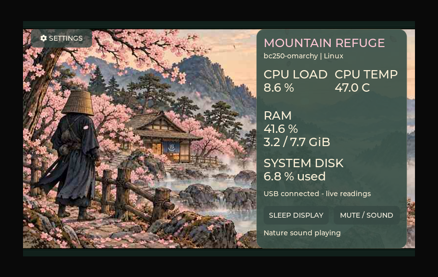

# BC250 Ronin resource panel

An Elecrow CrowPanel Advanced **5-inch ESP32-P4 V1.0** display for a BC250 desktop, with a serene animated ronin/onsen scene, day/night transitions, per-clip sound, and USB serial resource monitoring from Windows or Linux.

**Working:** CPU/RAM/disk usage, optional Windows CPU temperature through LibreHardwareMonitor, touchscreen sleep/wake, four SD video/audio clips, settings QR helper, and Bluetooth scanning/pairing experiments.

**Unfinished:** reliable GameSir button input and PC power-on relay, standby wiring, controller handoff, Commander Duo probe/RGB controls, native USB microphone/speaker and video streaming. A successful BLE connection is not a completed PC power-on solution.

## Continue on Windows

Clone this repository into a short path, then open PowerShell there:

If Git is not installed yet, use GitHub's **Code → Download ZIP**, extract it to a short path such as `C:\BC250`, and run the same commands below. The dependency release includes Git for the firmware build.

```powershell
powershell -NoProfile -ExecutionPolicy Bypass -File .\Get-Dependencies.ps1
powershell -NoProfile -ExecutionPolicy Bypass -File .\Build-Firmware.ps1
```

The first command downloads hash-verified release assets containing the pinned Windows SDK, toolchains and Python environments, then relocates them. The second creates a fresh `build-migrated` directory. It does not flash the board. Windows x64 is required for these prebuilt tools. Firmware source and installed managed components are in `project/work/panel-test`.

The existing display can be moved without reflashing. Start the companion using the newly assigned COM port:

```powershell
$py='.\project\work\idf-tools\python_env\idf5.5_py3.12_env\Scripts\python.exe'
& $py .\project\outputs\Resource-Panel\resource_panel.py --list-ports
& .\project\outputs\Resource-Panel\Windows-Monitor.ps1 -Action Start -Port COM7
```

See [HANDOVER.md](HANDOVER.md) for build, flashing, SD layout, Windows temperature setup, Linux companion instructions, testing and unfinished work. It also describes the separate complete private migration package; private-only files mentioned there are intentionally absent from this public repository. See [PUBLICATION.md](PUBLICATION.md) for the exact boundary.

## Media and firmware

All six supplied MP4 originals and the generated artwork versions are included. Current SD files are the eight `day3`, `nite3`, `sleep3`, and `wake3` `.rvj`/`.pcm` assets under `project/outputs/Resource-Panel/video/movies-v3`; place them in `/BC250` on the card. Each clip has its own audio; transition audio continues into the idle scene. Initial caching takes about 47 seconds and playback is approximately 10 fps.

Current release binary: `project/outputs/Resource-Panel/firmware/dashboard-movies-v3.bin`. Historical C exports in outputs are snapshots; **edit the full project source** in `project/work/panel-test`.

`Prepare-Media.py` rebuilds conversions into a new directory without overwriting supplied assets. The old procedural warp preview was rejected; the current animation uses supplied videos.

Third-party source and tools retain their own licenses. No new blanket license is assigned to vendor code or supplied media by this repository.

## Display preview



This preview uses an unchanged frame of the current day video and the firmware's bitmap fonts. The active image is 800 × 480 pixels. The [printable sizing preview](project/outputs/Resource-Panel/simulations/bc250-day-actual-size.html) and [physical-size SVG](project/outputs/Resource-Panel/simulations/bc250-day-actual-size.svg) use a 120.7 × 76.3 mm black front, with a centered 108 × 64.8 mm active area. Values are illustrative, assuming approximately 8 GiB assigned to system RAM; they are not measured BC250 results. See preview-details.json for assumptions. This is not a fabrication drawing.
