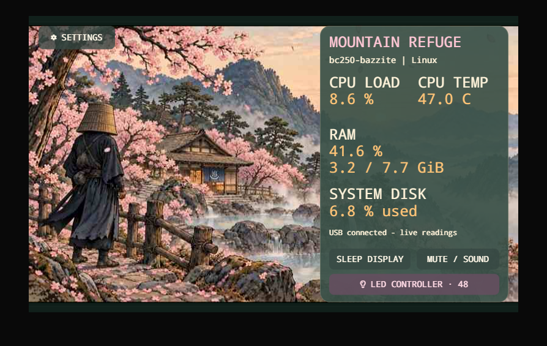

# Ronin display and companion

This is the original ESP32 resource-panel package, now contained in `display/`. The firmware and companion retain their existing paths under `project/` within this folder. For the enclosure, see the [project overview](../README.md) and [case-design guide](../case-design/README.md).

Case binary assets use **Git LFS**. Install Git LFS, then run `git lfs install` before cloning and `git lfs pull` inside the checkout afterward. Download ZIP is intended for the panel software workflow below; use a Git LFS checkout to obtain the complete case assets reliably.

## Baseline and newer prototype

The source, binaries and commands below are the **earlier published resource-panel baseline**. The newer local prototype has verified native menu/profiles and six Windows app tiles with existing-window focus and duplicate suppression. [Current status](CURRENT_STATUS.md) records its physical checks and Linux limits; this documentation update does not update the baseline firmware package.

The **Rev A SATA-powered LED adapter is ordered**. See [harness preparation](../case-design/manual/Ronin_LED_Harness_Rev_A.md) for sourced parts and unverified connector/mux interfaces. Two independent Matchstick channels, startup/fault handling and physical LEDs remain firmware/bench work.

## Resource panel — published baseline

An Elecrow CrowPanel Advanced **5-inch ESP32-P4 V1.0** display for a BC250 desktop, with a serene animated ronin/onsen scene, day/night transitions, per-clip sound, and USB serial resource monitoring from Windows or Linux.

**Working in this baseline:** CPU/RAM/disk usage, optional Windows CPU temperature through LibreHardwareMonitor, touchscreen sleep/wake, four SD video/audio clips, settings QR helper, and Bluetooth scanning/pairing experiments.

**Unfinished in this baseline:** the voice-companion workflow, two-board Matchstick ARGB control, app/page-aware touch shortcuts, reliable GameSir button input and PC power-on relay, standby wiring, controller handoff, and native USB microphone/speaker and video streaming. A successful BLE connection is not a completed PC power-on solution.

## Next display work

Linux, initially Bazzite, is the product baseline. Keep one shared companion/protocol and portable profiles, with explicit host-local paths, sensors, permissions and desktop bindings. Linux GUI/Wayland/Gaming Mode acceptance remains pending. Elgato software is not intended as a normal-operation requirement.

Planned work includes advanced effects for the two ten-pixel Matchsticks, resource-module configuration, automatic app-context/held shortcuts, gamepad host wake and AI voice. Current touch releases/manual profiles do not establish those broader features. Display Sleep/Wake does not operate PC power; scene audio and Claude/Codex host-app tiles are not a completed voice workflow. See [current status](CURRENT_STATUS.md) before choosing a package or making feature claims.

## Continue on Windows

Clone this repository into a short path, then open PowerShell there:

If Git is not installed yet, use GitHub's **Code → Download ZIP**, extract it to a short path such as `C:\BC250`, and run the same commands below. The dependency release includes Git for the firmware build.

```powershell
cd .\display
powershell -NoProfile -ExecutionPolicy Bypass -File .\Get-Dependencies.ps1
powershell -NoProfile -ExecutionPolicy Bypass -File .\Build-Firmware.ps1
```

Run all subsequent commands from `display/`. The dependency script downloads hash-verified release assets containing the pinned Windows SDK, toolchains and Python environments, then relocates them. The build script creates a fresh `build-migrated` directory. It does not flash the board. Windows x64 is required for these prebuilt tools. Firmware source and installed managed components are in `project/work/panel-test`.

The existing display can be moved without reflashing. Start the companion using the newly assigned COM port:

```powershell
$py='.\project\work\idf-tools\python_env\idf5.5_py3.12_env\Scripts\python.exe'
& $py .\project\outputs\Resource-Panel\resource_panel.py --list-ports
& .\project\outputs\Resource-Panel\Windows-Monitor.ps1 -Action Start -Port COM7
```

See [HANDOVER.md](HANDOVER.md) for build, flashing, SD layout, Windows temperature setup, Linux companion instructions, testing and unfinished work. It also describes the separate complete private migration package; private-only files mentioned there are intentionally absent from this public repository. See [PUBLICATION.md](PUBLICATION.md) for the exact boundary.

## Media and firmware

All six supplied MP4 originals and the generated artwork versions are included. Current SD files are the eight `day3`, `nite3`, `sleep3`, and `wake3` `.rvj`/`.pcm` assets under `project/outputs/Resource-Panel/video/movies-v3`; place them in `/BC250` on the card. Each clip has its own audio; transition audio continues into the idle scene. Initial caching takes about 47 seconds and playback is approximately 10 fps.

Current release binary: `project/outputs/Resource-Panel/firmware/dashboard-movies-v3.bin`. Historical C exports in outputs are snapshots; **edit the full project source** in `project/work/panel-test`.

`Prepare-Media.py` rebuilds conversions into a new directory without overwriting supplied assets. The old procedural warp preview was rejected; the current animation uses supplied videos.

Third-party source and tools retain their own licenses. No new blanket license is assigned to vendor code or supplied media by this repository.

## Display preview


This preview uses an unchanged frame of the current day video and the firmware's bitmap fonts. The active image is 800 × 480 pixels. The [printable sizing preview](project/outputs/Resource-Panel/simulations/bc250-day-actual-size.html) and [physical-size SVG](project/outputs/Resource-Panel/simulations/bc250-day-actual-size.svg) use a 120.7 × 76.3 mm black front, with a centered 108 × 64.8 mm active area. Values are illustrative, assuming approximately 8 GiB assigned to system RAM; they are not measured BC250 results. See preview-details.json for assumptions. This is not a fabrication drawing.

## Bazzite preview — historical UI concept



[Interactive preview](project/outputs/Resource-Panel/simulations/bazzite/bazzite-interactive-preview.html) (download and open locally): DroidSansM Nerd Font Mono, LED controller concept for two 24-pixel rings, and 120.7 × 76.3 mm outer dimensions with 3.5 mm top and 7.5 mm bottom bands. Native image is 800 × 480; the physical illustration models a 108 × 65.3 mm active area. This is a simulated UI, not flashed firmware or a fabrication drawing. [Preliminary wiring notes](project/outputs/Resource-Panel/simulations/bazzite/NEOPIXEL-WIRING.md).

This preserved Bazzite preview predates the current lighting hardware. Its two 24-pixel ring controls are historical UI concepts; the current target is two ten-LED Rainbow on a Matchstick boards. Matchstick control, voice interaction, host gamepad wake and automatic context switching remain pending. Manually selected action pages now work in the newer local prototype described in [current status](CURRENT_STATUS.md); this historical preview remains unchanged.
